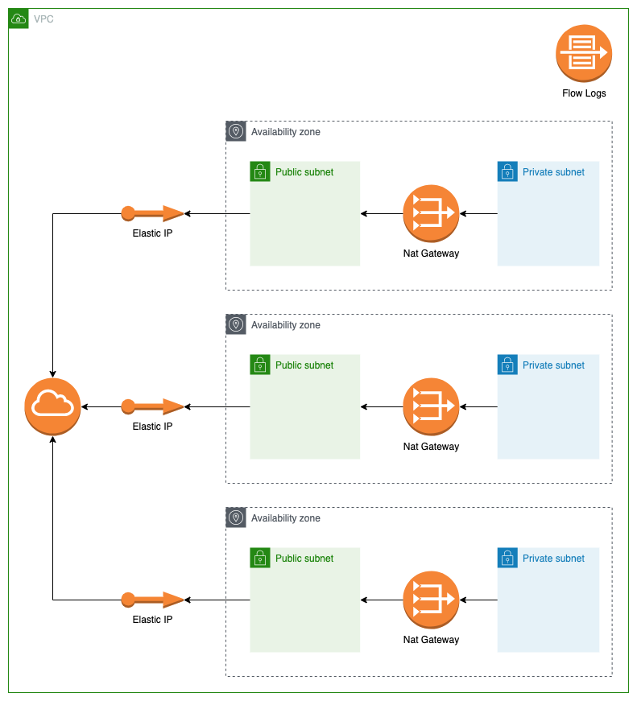

## Architecture

## Variables

| Name | Description | Type | Default | Required |
|------|-------------|------|---------|:--------:|
|  [name](#input\_name) | (Required) The name of the vpc | `string` | n/a | yes |
|  [AWS\_REGION](#input\_aws\_region) | (Optional, default 'eu-west-1') The region where to deploy this code. | `string` | `eu-west-1` | no |
|  [cidr\_block](#input\_cidr\_block) | (Optional) The IPv4 CIDR block for the VPC. | `string` | n/a | no |

## Outputs

| Name | Description |
|------|-------------|
|  [cidr\_block](#output\_cidr\_block) | n/a |
|  [main\_route\_table\_id](#output\_main\_route\_table\_id) | n/a |
|  [private\_route\_table\_ids](#output\_private\_route\_table\_ids) | n/a |
|  [private\_subnet\_ids](#output\_private\_subnet\_ids) | n/a |
|  [public\_ips](#output\_public\_ips) | n/a |
|  [public\_subnet\_ids](#output\_public\_subnet\_ids) | n/a |
|  [vpc\_id](#output\_vpc\_id) | n/a |
